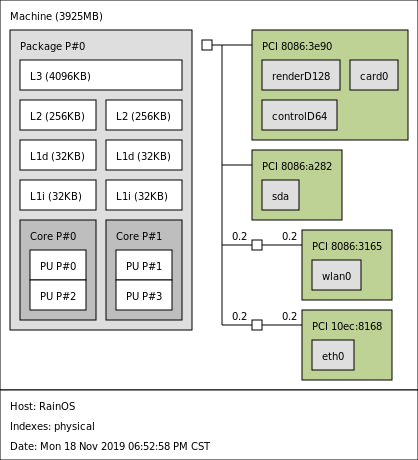
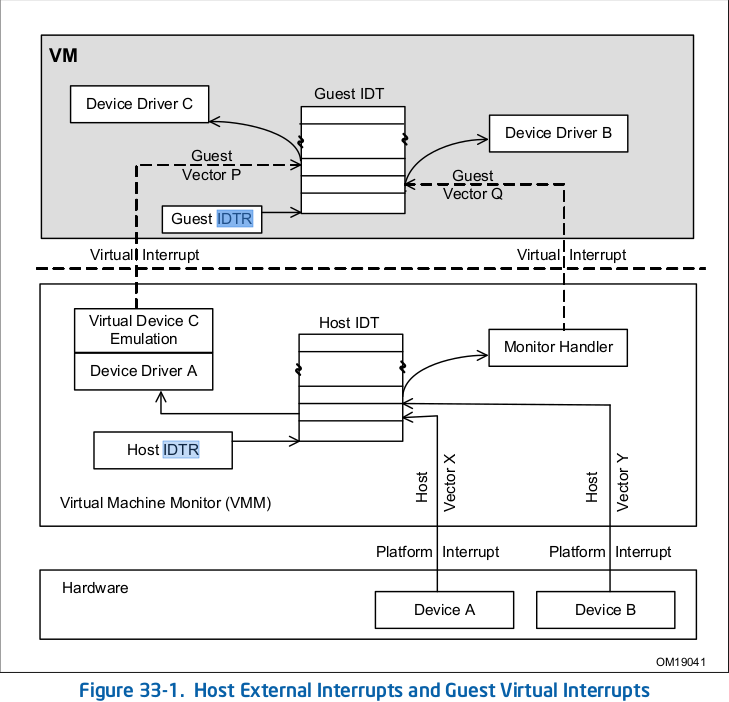
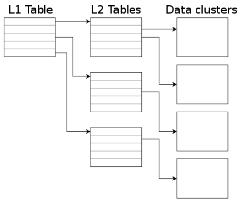
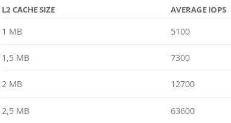

# 虚拟机性能优化

[参考RHEL7 PerformanceTuningGuide](https://access.redhat.com/documentation/en-us/red_hat_enterprise_linux/7/pdf/performance_tuning_guide/Red_Hat_Enterprise_Linux-7-Performance_Tuning_Guide-en-US.pdf)

## 开始前的准备

### 编译Qemu文档

进入文档目录

	cd /path/to/qemu/docs
	mkdir _build
	sphinx-build . _build

生成文件

	_build/index.html

### 编译kernel文档

在内核目录执行

	cd /path/to/src/kernel/
	make htmldocs

生成文件

	Documentation/output/index.html

## Latency

[FindingOriginsOfLatenciesUsingFtrace](Finding_Origins_of_Latencies_Using_Ftrace.pdf)

延时的定义

一个事件实际执行的时间点和本应该要在哪个时间点执行的时间差

内核中导致延时的四个情景

- 禁止中断(导致任务无法处理)
- 禁止抢占(阻止激活的任务无法运行)
- 调度延时
- 中断倒转(中断优先级比其中断的任务优先级低)

使用trace来测量相应的延时

- 禁止中断(irqoff)
	追踪关中断时间
- 禁止抢占(preemptoff)
	追踪抢占/中断任一被关闭的最大延迟时间。
- 调度延时(wakeup, wakeup_rt)
	追踪普通进程从被唤醒到真正得到执行之间的延迟
- 中断倒转

## 优化前的信息收集

查看Qemu启动后都有那些线程

	./scripts/find_thread_name.sh

	pid(14912) qemu-system-x86
	pid(14913) call_rcu
	pid(14914) trace-thread
	pid(14916) IO mon_iothread
	pid(14917) CPU 0/KVM
	pid(14918) CPU 1/KVM
	pid(14921) SPICE Worker
	pid(14922) vnc_worker

## CPU隔离

[Linux的tickless设置](http://www.litrin.net/2018/11/15/linux的tickless设置/)

isolcpus

- isolate one or more CPUs from the scheduler with the isolcpus boot parameter.
	This prevents the scheduler from scheduling any user-space threads on this CPU.

- Once a CPU is isolated, you must manually assign processes to the isolated CPU,
	either with the CPU affinity system calls or the numactl command

tickless and dynamic tickless kernel(CONFIG_NO_HZ_FULL)

- tickless does not interrupt idle CPUs in order to reduce power usage and allow newer processors to take advantage of deep sleep states
- dynamic tickless is useful for very latency-sensitive workloads, such as high performance computing or realtime computing

开启内核配置选项(dynamic tickless config)

	CONFIG_NO_HZ_FULL

通过在启动参数中设置isolcpus来配置cpu隔离和内核tick

在/etc/default/grub中设置

	GRUB_CMDLINE_LINUX_DEFAULT="isolcpus=1,3 nohz_full=1,3"

重新生成grub.cfg

	grub-mkconfig -o /boot/grub/grub.cfg

查看修改是否成功

	cat /proc/cmdline

测试程序

	# ./isol_cpu_test.sh

对测试结果解读

	grep 'Local timer interrupts' /proc/interrupts

未配置隔离核和全时钟中断的的情况下每个核上的中断一般在1000ticks左右

配置后在隔离核上理论上只有1个ticks(实际测试平均都在10ticks以内)

## 关于x2APIC

[Virt2apic](https://fedoraproject.org/wiki/Features/Virtx2apic)

**x2apic优点**

- x2apic improves guest performance by reducing the overhead of APIC access,
	which is used to program timers and for issuing inter-processor interrupts.
	By exposing x2apic to guests, and by enabling the guest to utilize x2apic,
	we improve guest performance

- improved guest performance and lower cpu utilization

x2APIC是硬件特性,内核提供一些参数来控制

默认开启,可以在/etc/default/grub中禁止该功能

	GRUB_CMDLINE_LINUX_DEFAULT="nox2apic"

开机后查看是否由该功能

	cat /proc/cpuinfo | ag x2apic
	dmesg | ag x2apic

**xAPIC模式**

- APIC寄存器被映射到4KB大小的内存区,因此访问APIC是通过MMIO

**x2APIC模式下**

- 一部分MSR地址区间为APIC寄存器预留,访问APIC是通过MSR

**测试方法**

- measure the overhead of an IPI with and without x2apic

## 中断虚拟化(Interrupt)

模拟中断和直接分配设备产生的中断示意图

[参考来源:intel sdm vol 3c]()

### 中断亲和性(Interrupt Affinity)

**Balancing Interrupts Manually**

- 找出需要配置的中断
- 确认平台是否支持中断分发
	check BIOS

- 确认APIC的工作模式
	disable x2apic

设置smp_affinity

	echo mask > /proc/irq/irq_number/smp_affinity

content of smp_affinity files can be obtained by

	for i in $(seq 0 300); do grep . /proc/irq/$i/smp_affinity /dev/null 2>/dev/null; done

查看中断N绑定的cpu

	cat /proc/irq/N/smp_affinity_list

### irqbalance代码实现

irqbalance(v1.0.7)的主函数10s一个周期做以下事情

- 清除上次统计结果
- 分析中断情况
- 分析中断的负载情况
- 计算如何平衡中断
- 实施上面指定的方案

通过/proc/stat来计算中断负载(irq+softirq)

以下时cpu0的数据

|数值|参数|含义|
|--|--|--
|200118431|	user|	处于用户态的运行时间,不包含 nice值为负进程
|1258|	nice|	nice值为负的进程所占用的CPU时间
|112897097|	system|	处于核心态的运行时间
|1062445972|	idle|	除IO等待时间以外的其它等待时间
|321829|	iowait|	IO等待时间(since 2.5.41)
|0|	irq|	硬中断时间
|1048436|	softirq|	软中断时间
|0|	steal|	-
|0|	guest|	-
|0|	guest_nice|	-

cpu->last_load = (irq_load + softirq_load)

- 每个CORE的负载是附在上面的中断的负载的总和
- 每个DOMAIN是包含的CORE的总和
- 每个PACKAGE包含的DOMAIN的总和,就像树层次一样的计算

### 关于Cache

[参考: irqbalance详解](https://segmentfault.com/a/1190000015426246)

查看cpu各cache的信息

	tree -L 1 /sys/devices/system/cpu/cpu0/cache/
	/sys/devices/system/cpu/cpu0/cache/
	├── index0   -> L1 data缓存
	├── index1   -> L1 Instruction缓存
	├── index2   -> L2 缓存
	└── index3   -> L3 缓存

## 内存信息

RSS(ResidentSetSize)表示进程占用的物理内存大小, 但是将各进程的RSS值相加,通常会超出整个系统的内存消耗,这是因为RSS中包含了各进程间共享的内存

PSS(ProportionalSet size)所有使用某共享库的程序均分该共享库占用的内存时,每个进程占用的内存,显然所有进程的PSS之和就是系统的内存使用量.它会更准确一些,它将共享内存的大小进行平均后,再分摊到各进程上去.

USS(UniqueSetSize)进程独自占用的内存,它是PSS中自己的部分`(PSS = USS + sharelib)`,它只计算了进程独自占用的内存大小,不包含任何共享的部分

- VSS(VirtualSetSize)虚拟耗用内存(包含共享库占用的内存)
- RSS(ResidentSetSize)实际使用物理内存(包含共享库占用的内存)
- PSS(ProportionalSetSize)实际使用的物理内存(比例分配共享库占用的内存)
- USS(UniqueSetSize)进程独自占用的物理内存(不包含共享库占用的内存)

### smem的使用

根据rss查看内存使用情况饼图

	smem --pie name -s rss

根据uss查看内存使用情况柱形图

	smem --bar name -s uss

将主机A的信息采集后打包

	smemcap > memorycapture.tar

在主机B上查看相应的结果

	smem -S memorycapture.tar --bar name -s uss

## perf火焰图(在测试机器上执行)

发现使用同样的perf.data在不同机器上生成图片不一致

获取flame源码

	git clone https://github.com/brendangregg/FlameGraph.git

采集qemu数据

	perf record -a -g -p `pidof qemu-system-x86_64` sleep 30

用perf script工具对perf.data进行解析

	perf script -i perf.data &> perf.unfold

将perf.unfold中的符号进行折叠

	./stackcollapse-perf.pl perf.unfold &> perf.folded

生成svg图片

	./flamegraph.pl perf.folded > perf.svg

或者将perf.data拷贝到FlameGraph目录中,执行脚本[genfg.sh](genfg.sh)

## Qemu Trace

[参考qemu2.7/doc/tracing.txt](tracing.txt)

编译Qemu的时候配置相关的选项

    ./configure --enable-trace-backends=simple

在gentoo中手动修改ebuild文件后通过localoverlay安装

手动创建一个需要trace的事件列表(可选)

	echo bdrv_aio_readv   > /tmp/events
	echo bdrv_aio_writev >> /tmp/events

启动Qemu时设定events,trace file, monitor

    qemu -trace events=/tmp/events,file=trace.bin -monitor stdio ...

使用qemu源码中的脚本分析trace file(trace.bin)

	cd qemu-source/
	./simpletrace.py ../trace-events /path/to/trace.bin
	./simpletrace.py ../trace-events-all /path/to/trace.bin

输出格式

	eventname delta_ns/1000 pid args...
	事件名字 耗时(us) 进程ID 函数参数

在Qemu monitor中设置event

	(qemu) trace-event xxx-event <on | off>

开关trace file功能

	(qemu) trace-file <on | off>

### TraceEvent的使用

在Qemu源码中每个目录都有一个trace-events文件
在这个文件中定义了trace中如何打印参数(对应trace.bin中的输出)

## 通过qcow2 L2 cache

[Improving disk IO performance](https://blogs.igalia.com/berto/2015/12/17/improving-disk-io-performance-in-qemu-2-5-with-the-qcow2-l2-cache/)

qcow2镜像大小是on demand的
qcow2的组成单元是clusters(default 64KB)

手动修改cluster size大小为128KB

	qemu-img create -f qcow2 -o cluster_size=128K hd.qcow2 4G

qcow2 image通过两级表来映射给guest

一个disk image对应一个L1,且L1一直存在内存中
L2的张数则和disk image的大小有关
Qemu中为了加速对L2表的访问在内存中提供了L2的cache

L2cache大小对性能的影响

可映射到guest的磁盘大小计算公式如下

	disk_size = l2_cache_size * cluster_size / 8

如果cluster_size默认64KB的话

	disk_size = l2_cache_size * 8192

如果要映射nGB磁盘大小的话l2 cache大小计算公式如下

	l2_cache_size = disk_size_GB * 131072

Qemu默认的L2 cache大小是1MB,所以对应的8GB的默认磁盘大小

如何配置cache size

- l2-cache-size: maximum size of the L2 table cache
- refcount-cache-size: maximum size of the refcount block cache
- cache-size: maximum size of both caches combined

配置时需要注意的两点

- L2 cache和refcount block cache都要是cluster size的倍数
- 设之三面三个中的一个参数,qemu会自动调整其他两个参数保证(L2cache 大于4倍的refcount cache)

所以下面的三条设置是等效的

	-drive file=hd.qcow2,l2-cache-size=2097152
	-drive file=hd.qcow2,refcount-cache-size=524288
	-drive file=hd.qcow2,cache-size=2621440

减少内存使用(多快照情况下)

	-drive file=hd.qcow2,cache-clean-interval=900

多个快照的情况下,可以将不需要使用的cache定时释放,减少内存使用
