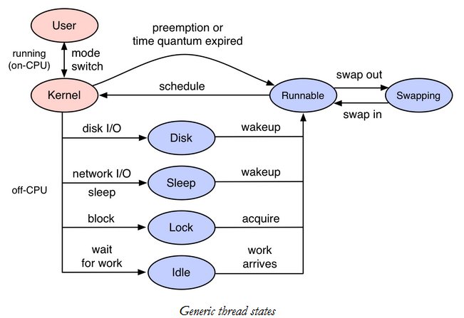

# BPF

## Install

安装必要软件(xenial)

	apt-get -y install bison build-essential cmake flex git libedit-dev \
	  libllvm3.7 llvm-3.7-dev libclang-3.7-dev python zlib1g-dev libelf-dev

Install and compile BCC

	git clone https://github.com/iovisor/bcc.git
	mkdir bcc/build; cd bcc/build
	cmake .. -DCMAKE_INSTALL_PREFIX=/usr
	make
	sudo make install

默认安装路径在(/usr/share/bcc/tools/)

	export PATH=$PATH:/usr/share/bcc/tools

## Basic Usage(/usr/share/bcc/tools)

查看每个disk IO的延时

	biosnoop -Q

测量disk IO

	biolatency

查看文件系统page cache命中率

	cachestat

采集内核和用户栈回溯信息用"--"分割开

	profile -p `pidof qemu-system-x86_64` -d 5

将调用信息写成一行输出

	profile -p `pidof qemu-system-x86_64` -d -f 5

输出到文件,绘制火焰图

	profile -df -p `pidof qemu-system-x86_64` 5 > /tmp/out.profile
	./flamegraph.pl < /tmp/out.profile > out.svg

在内核函数中添加一个"_[k]", 内核调用使用橙色显示,用户态调用使用红色显示

	profile -adf -p `pidof qemu-system-x86_64` 5 > /tmp/out.profile
	./flamegraph.pl --color=java < /tmp/out.profile > out.svg

用on/off-cpu测试性能

[参考: 用off-cpu火焰图进行Linux性能分析](https://blog.csdn.net/21cnbao/article/details/103659178)

[参考: Off-CPU Analysis](http://www.brendangregg.com/offcpuanalysis.html)

有时候性能差的原因瓶颈不一定在CPU上面,而是在off-cpu的时间,比如

- 进程进入系统调用执行io动作,io动作的延迟
- 进程等待mutex锁的时间
- 内存被交换,swap的时间
- 内存不够的时候,执行直接内存回收的时间
- 进程被抢占调度走、或者时间片用完被调度走的时间(runqueue太大)

采集qemu 30秒钟offcpu的性能数据绘制火焰图

	offcputime -df -p `pidof qemu-system-x86_64` 30 > /tmp/out.stacks
	./flamegraph.pl --color=io --title="Off-CPU Time Flame Graph" --countname=us /tmp/out.stacks > /tmp/output.svg

如何测试qemu写镜像文件速度(在主机上测试写文件大于1ms的进程)

	fileslower 1
